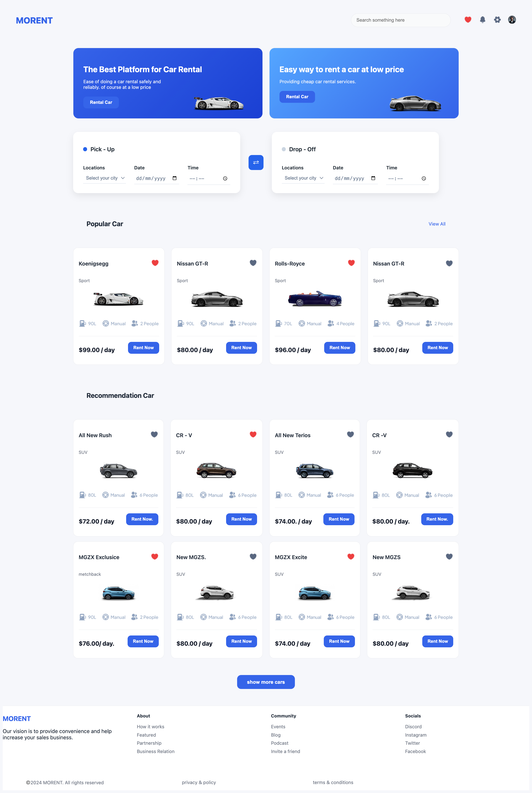
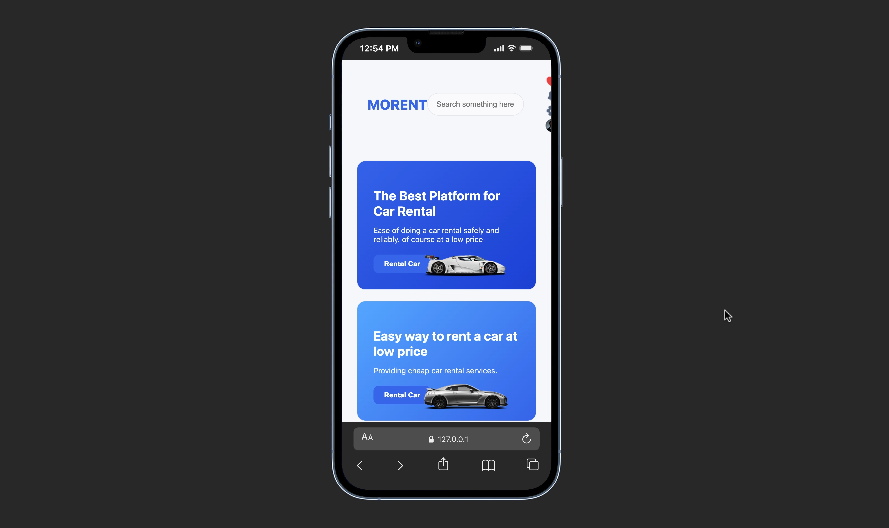

# Whitespace saas landing page

## Preview

This is a car rent site created using HTML and CSS given by our teachers at Rebase Code Camp. We learned a lot while building the project because we met things we haven't done before but because of research using w3school other platforms we succeeded to do it on stuff like video display content and so many. 

## Built With
- HTML 5
- CSS

## Prerequisites
- HTML
- CSS

## Clone Project
Run this prompt on your terminal "https://github.com/Dorian4563/car-rent-replicate/pull/1"

## Live Site
[Link](https://car-rent-replicate-fy7y.vercel.app/)

## Author
**Dorian**